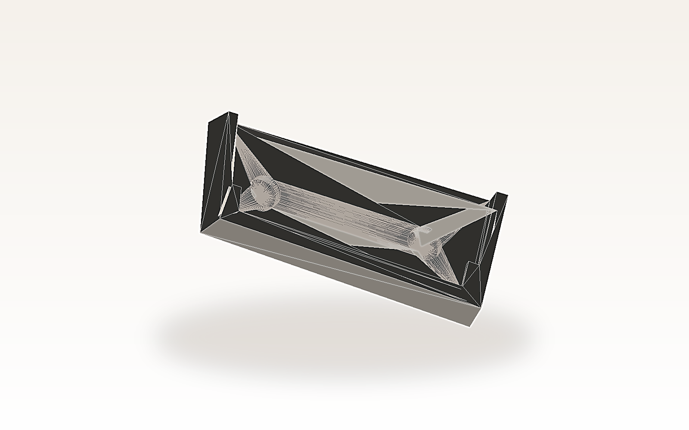
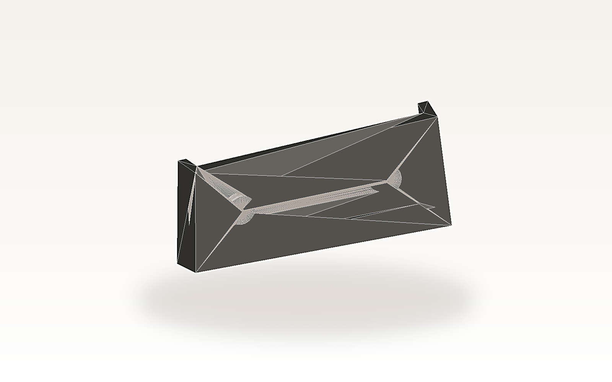

# M5Paper S3 Wall Mount

日本語: M5Stack社のM5Paper S3を、画鋲2本で壁に掛けるための3Dプリント用マウントです。設計データはOpenSCADで管理しており、印刷用のSTLも同梱しています。

English: A 3D-printable wall mount for the M5Stack M5Paper S3 that hangs on two thumbtacks. The original design is maintained in OpenSCAD, and a ready-to-print STL is included.




## 概要 / Overview

- M5Paper S3 を壁にすっきり掛けて使うためのシンプルなホルダーです。
- 2本の画鋲を壁に固定し、その軸にマウント背面の穴を通して取り付けます。
- M5Paper S3 本体は前面の開口部から差し込み、下側のストッパーで位置決めします。

- A simple holder for mounting the M5Paper S3 on a wall.
- The mount attaches to two thumbtacks driven into the wall, using the rear pin holes.
- The device slides in from the front opening and is positioned by the lower stopper tabs.

## 特長 / Features

- OpenSCADソース付きで、寸法の調整や派生モデル作成がしやすい
- すぐに印刷できる `M5PaperS3WallMount.stl` を同梱
- 画鋲の頭を逃がす円形リセス付き
- 画鋲の軸を通す貫通穴付き

- Includes the original OpenSCAD source for easy customization
- Ships with a ready-to-print `M5PaperS3WallMount.stl`
- Circular rear recesses provide clearance for thumbtack heads
- Through-holes align the mount to the thumbtack pins

## ファイル構成 / Files

- `M5PaperS3WallMount.scad`: オリジナルのOpenSCADソース / Original OpenSCAD source
- `M5PaperS3WallMount.stl`: 3Dプリント用のSTL / STL for 3D printing
- `tools/render_stl_preview.py`: STLからREADME用PNGを生成するスクリプト / Script for rendering README PNGs from the STL
- `assets/preview-front.png`: README掲載用の前方イメージ / Front preview image for the README
- `assets/preview-rear.png`: README掲載用の背面イメージ / Rear preview image for the README

## 寸法 / Dimensions

- 外形サイズ: 約 131.5 mm x 17.7 mm x 55.0 mm
- 開口部サイズ: 約 121.5 mm x 50.0 mm
- 画鋲頭用リセス: 直径 15 mm、深さ 5 mm
- 画鋲ピン用穴: 直径 1.4 mm

- Outer size: about 131.5 mm x 17.7 mm x 55.0 mm
- Front opening: about 121.5 mm x 50.0 mm
- Thumbtack head recesses: 15 mm diameter, 5 mm deep
- Thumbtack pin holes: 1.4 mm diameter

## 印刷のヒント / Printing Notes

- 背面の平らな面をビルドプレート側にして印刷すると安定します。
- 一般的なFDMプリンタでは、通常はサポートなしでも印刷しやすい形状です。
- 機器差やプリンタ差で嵌合が変わるため、必要に応じてOpenSCAD側で寸法を微調整してください。

- Print with the flat rear face on the build plate for stability.
- On a typical FDM printer, the model should usually print without supports.
- Fit can vary by printer and material, so adjust dimensions in OpenSCAD if needed.

## 使い方 / Usage

1. `M5PaperS3WallMount.stl` を3Dプリントします。
2. 壁に画鋲を2本取り付けます。
3. マウント背面の穴を画鋲に合わせて壁へ固定します。
4. M5Paper S3 を前面から差し込みます。

1. Print `M5PaperS3WallMount.stl`.
2. Install two thumbtacks in the wall.
3. Hang the mount on the thumbtacks using the rear holes.
4. Slide the M5Paper S3 in from the front.

## OpenSCAD からの再生成 / Regenerating the STL

OpenSCAD がインストールされていれば、以下のコマンドで STL を再生成できます。

If OpenSCAD is installed, regenerate the STL with:

```sh
openscad M5PaperS3WallMount.scad -o M5PaperS3WallMount.stl
```

README掲載画像は、STLから以下のように再生成できます。

README preview images can be regenerated from the STL with:

```sh
python3 tools/render_stl_preview.py M5PaperS3WallMount.stl assets/preview-front.png front
python3 tools/render_stl_preview.py M5PaperS3WallMount.stl assets/preview-rear.png rear
```

## 注意 / Notes

- 本データは M5Paper S3 向けに作成した個人制作のマウントです。
- 使用する画鋲や壁材によって保持力は変わるため、安全性は現物で確認してください。
- `M5Paper S3` および `M5Stack` はそれぞれの権利者に帰属する名称です。

- This is an independent wall-mount design for the M5Paper S3.
- Holding strength depends on the thumbtacks and wall material, so verify safety with your own setup.
- `M5Paper S3` and `M5Stack` are names owned by their respective rights holders.
